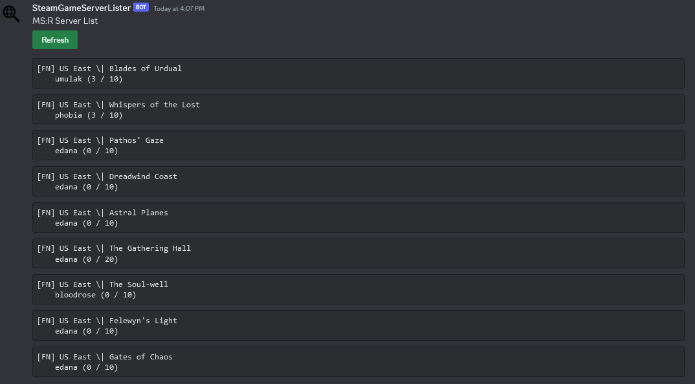

# Steam Server Browser Discord Bot

A persistent bot that displays the servers for some steam game, simply set the preferred appID.
If you want more filtering options for the server list result, see [Valve Dev Wiki](https://developer.valvesoftware.com/wiki/Master_Server_Query_Protocol#Game_server_to_master_server).

### Parameters
* STEAM_APPID
* STEAM_API_KEY (Web API key)
* DISCORD_TOKEN

